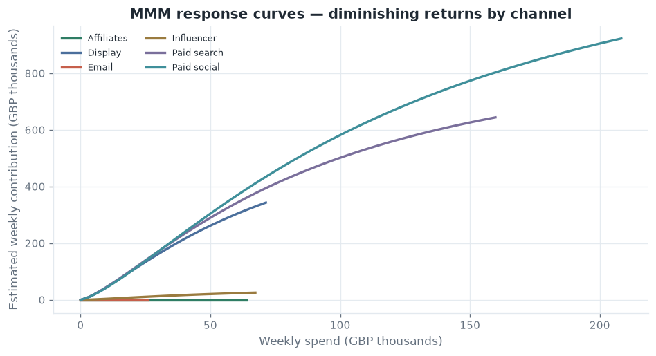
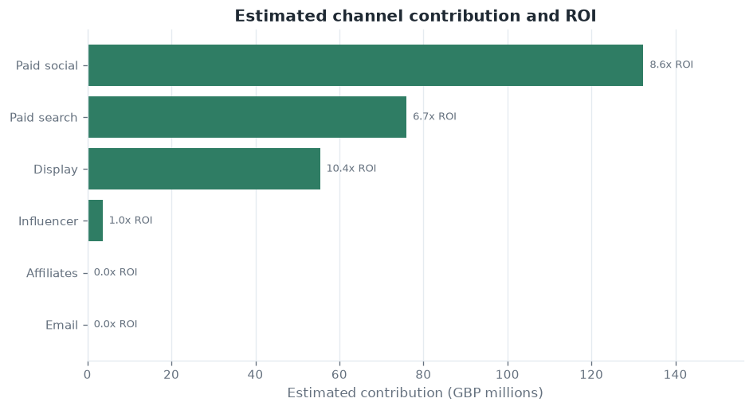
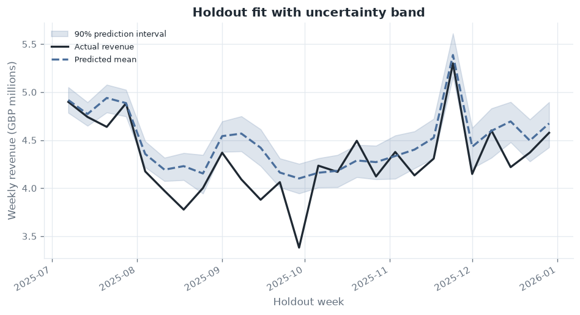
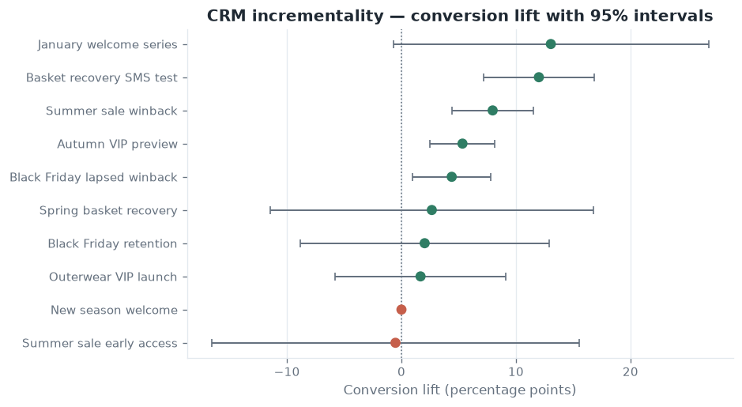
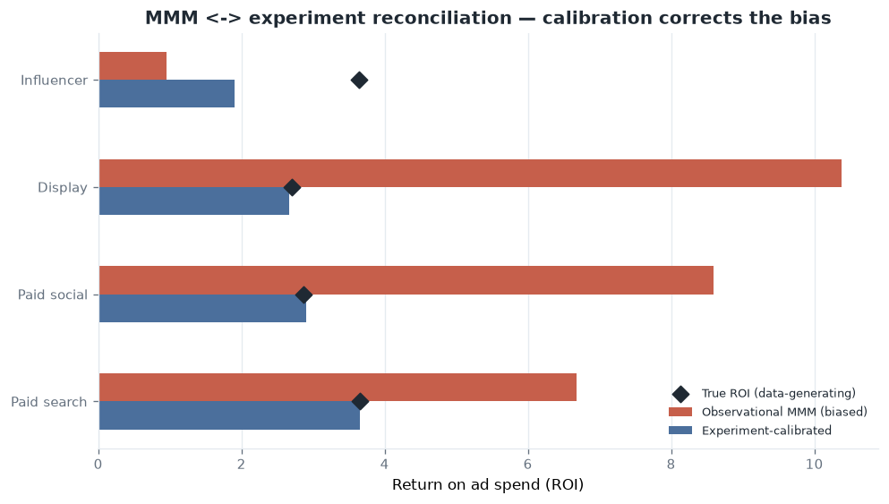

# Marketing Effectiveness Lab

> [!IMPORTANT]
> **📦 Archived — this work continues in [responsible-neobank-growth](https://github.com/rosscyking1115/responsible-neobank-growth).**
>
> This lab's marketing-measurement methodology has been folded into the
> [Responsible Neobank Growth](https://github.com/rosscyking1115/responsible-neobank-growth)
> platform, where the same causal-inference stack (CUPED, diff-in-diff, geo-lift,
> synthetic control) now lives alongside experimentation governance and release gating:
>
> - **MMM ↔ experiment reconciliation** ("closing the causal loop", 4.78×→0.45× error) → [`docs/case-studies/mmm-experiment-reconciliation.md`](https://github.com/rosscyking1115/responsible-neobank-growth/blob/main/docs/case-studies/mmm-experiment-reconciliation.md)
> - **Parameter-recovery & calibration validation** → [`docs/methodology/parameter-recovery-validation.md`](https://github.com/rosscyking1115/responsible-neobank-growth/blob/main/docs/methodology/parameter-recovery-validation.md)
> - **Benchmark note vs Meridian / Robyn / PyMC-Marketing** → [`docs/methodology/mmm-benchmark-note.md`](https://github.com/rosscyking1115/responsible-neobank-growth/blob/main/docs/methodology/mmm-benchmark-note.md)
>
> The code here remains complete and runnable as of the final release; the live
> dashboard and docs stay available as a historical reference. No further development
> happens in this repository.

[](https://github.com/rosscyking1115/marketing-effectiveness-lab/actions/workflows/ci.yml)


Marketing mix modelling (MMM), incrementality evidence, CRM experimentation, connector data
quality, and profit-aware budget decisions, built as a reusable Python package with a
Streamlit dashboard.

> [!NOTE]
> This is a reference implementation, not a commercial product. It runs on deterministic demo
> data and real *public* datasets, and every modelling assumption and boundary is written down
> instead of hidden. [`docs/methodology.md`](docs/methodology.md) covers the measurement
> approach and how it is validated.

- Project site: <https://rosscyking1115.github.io/marketing-effectiveness-lab/>
- Live dashboard: <https://marketing-effectiveness-lab.streamlit.app/>

A single ROI number is easy to produce. What makes one worth acting on is the chain behind it:
data contract → source validation → diagnostics → modelling → incrementality evidence →
uncertainty → budget optimisation → stakeholder communication → governance.


## What it does

### Data onboarding

Versioned data contracts and connector templates for ecommerce, web analytics, paid media,
CRM, affiliate, influencer, display, and external-control exports. Connectors assemble into an
MMM-ready weekly dataset, with source-coverage and data-quality diagnostics.

### Measurement and modelling

- Baseline econometrics with time-aware holdout validation.
- MMM-style adstock, saturation, contribution, ROI, and response curves.
- Uncertainty intervals and a lightweight Bayesian posterior layer.
- Lift-test evidence upload, quality governance, and experiment-informed calibration.

### Decisions

Profit-aware scenario planning and constrained budget optimisation, with readiness gates that
a recommendation has to clear before anyone sees it. Outputs an executive summary and a
one-page stakeholder brief (Markdown, plus PDF).

### Customer and CRM growth

- Cohort, CLV, and lapse-risk analytics; target/holdout CRM incrementality with confidence
  intervals.
- Retention action planning, and a CRM experiment workflow covering design, audience
  assignment, launch calendar, post-launch readouts, and a reusable learning library.

### Governance and reproducibility

Machine-readable model-run manifests, a local artifact registry, and a workflow for comparing
manifests. Access governance covers role-based permissions, an approval workflow with
separation of duties, and a hash-chained audit log that makes tampering visible.

## Example outputs

Real figures produced by the package on the demo data (regenerate with
`uv run --group viz python scripts/generate_readme_assets.py`).

| | |
| --- | --- |
|  |  |
| Response curves: diminishing returns by channel, used to decide where the next pound of spend pays back. | Contribution and ROI: where revenue comes from, and which channels earn their spend. |
|  |  |
| Holdout uncertainty: actual against predicted revenue with a 90% band, so a recommendation carries its own confidence. | CRM incrementality: conversion lift with 95% intervals. Green campaigns show evidence of real lift; grey and red do not. |

## Does the model actually work?

The demo data is generated from known adstock, saturation, and effect parameters, so the model
can be checked against the truth rather than judged on plausibility. Two questions follow: does
it recover those parameters, and is its uncertainty honest? Write-up in
[`docs/validation.md`](docs/validation.md).

| | |
| --- | --- |
|  |  |
| Calibration: empirical holdout coverage against nominal. The 90% posterior interval covers about 81% of held-out weeks, measured rather than asserted. | Recovery: all 6 true channel ROIs land inside their 90% intervals, but the point estimates are inflated by roughly 2–3× through media/seasonality confounding. The uncertainty is honest; the central estimate is biased. |

Building this turned up a real numerical bug, an ill-conditioned Bayesian posterior that had
collapsed interval coverage to zero. The write-up has the diagnosis and the fix.

That bias is an identification problem, so no amount of tuning removes it. An experiment can.
Simulating geo-lift tests against the known ground truth and running them through the
calibration layer pulls the inflated ROI back towards truth, cutting mean error from 4.78× to
0.45×, about 91% closer. Write-up in [`docs/reconciliation.md`](docs/reconciliation.md).



## Tech stack

| Area | Tools |
| --- | --- |
| Language | Python ≥ 3.11 |
| Data & modelling | pandas, NumPy, statsmodels |
| App & charts | Streamlit, Plotly |
| Tooling | uv (env & lockfile), pytest, ruff |
| Optional groups | `data` (openpyxl, real public data), `brief` (reportlab, PDF brief), `viz` (matplotlib, README figures) |

## Quick start

Prerequisite: [uv](https://docs.astral.sh/uv/).

```powershell
# Generate the deterministic demo dataset (written to data/demo/)
uv run python scripts/generate_demo_data.py

# Launch the analyst dashboard
uv run streamlit run app/streamlit_app.py --server.port 8501 --server.headless true

# Tests and lint
uv run --group dev pytest
uv run --group dev ruff check .
```

The repository also includes a root `streamlit_app.py` entrypoint used by Streamlit Cloud.

## Working with real public data

The pipeline runs on the UCI Online Retail II dataset (a UK online retailer), not only on
synthetic data.

```powershell
# Customer / cohort / CLV analytics on real transactions
uv run --group data python scripts/load_public_data.py

# Assemble a weekly MMM outcome dataset through the connector pipeline
uv run --group data python scripts/build_public_mmm_dataset.py
```

> [!TIP]
> Each script writes a provenance-documented summary to `data/public/` (git-ignored) that
> states exactly which fields are real versus imputed. See
> [`docs/phase-41-real-public-data.md`](docs/phase-41-real-public-data.md) and
> [`docs/phase-44-real-connector-mmm.md`](docs/phase-44-real-connector-mmm.md).

## Stakeholder brief and governance demo

```powershell
# One-page business-impact brief (Markdown, plus PDF with the optional brief group)
uv run --group brief python scripts/build_stakeholder_brief.py

# Access-governance walkthrough (RBAC + approval workflow + tamper-evident audit log)
uv run python scripts/governance_demo.py
```

Generated artifacts are written under `.local/` (git-ignored) for local review.

## Project structure

```text
marketing-effectiveness-lab/
├─ app/streamlit_app.py        # Analyst dashboard
├─ streamlit_app.py            # Streamlit Cloud entrypoint
├─ src/marketing_effectiveness_lab/
│  ├─ analytics.py  mmm.py  modeling.py  bayesian.py  uncertainty.py
│  ├─ calibration.py  budget.py  reporting.py  governance.py  artifacts.py
│  ├─ customer.py  access.py
│  └─ data/                    # schema, connectors, assembly, diagnostics, generators,
│                              # online_retail adapter, shared feature definitions
├─ scripts/                    # demo data, real-data, stakeholder brief, governance demo
├─ tests/                      # pytest suite (19 files)
├─ docs/                       # project site (HTML) + phase notes (Markdown)
└─ data/demo/                  # generated demo data (git-ignored)
```

## Documentation

Start with [`docs/methodology.md`](docs/methodology.md), which covers adstock, saturation,
priors, holdout and geo-lift calibration, and how each step is validated.

- [`docs/validation.md`](docs/validation.md) asks whether the model recovers the known
  generating parameters and whether its intervals are honest (`scripts/validate_recovery.py`).
- [`docs/reconciliation.md`](docs/reconciliation.md) closes the causal loop: simulated geo-lift
  evidence calibrates the biased MMM back towards truth
  (`scripts/reconcile_mmm_experiments.py`).
- [`docs/cross-validation.md`](docs/cross-validation.md) covers rolling-origin backtesting
  across five quarters, and how this compares with Meridian, Robyn, and PyMC-Marketing
  (`scripts/rolling_origin_cv.py`).
- [`docs/model-card.md`](docs/model-card.md) states intended use, metrics, limitations, and
  when not to trust the model.
- [`docs/data-dictionary.md`](docs/data-dictionary.md) documents the weekly schema, connector
  templates, and assembly mapping.
- [`docs/production-security-roadmap.md`](docs/production-security-roadmap.md) records the
  security and data-handling position: RBAC and audit are demonstrated, authentication and
  storage are out of scope here.
- `docs/phase-*.md` are the dated design notes for each capability, from baseline econometrics
  through to real public data, the stakeholder brief, and access governance.

The project site at <https://rosscyking1115.github.io/marketing-effectiveness-lab/> is the
visual way in, with workflow, architecture, and data-contract pages.

## Deployment

The dashboard runs on Streamlit Community Cloud from `rosscyking1115/marketing-effectiveness-lab`,
branch `main`, main file `streamlit_app.py`. GitHub Pages serves the project site from the
`/docs` folder.

---

[`CONTRIBUTING.md`](CONTRIBUTING.md) lists the contribution lanes, [`SECURITY.md`](SECURITY.md)
covers the public-data policy, and the [`LICENSE`](LICENSE) is Apache-2.0, so this is free to
read, run, and build on.
