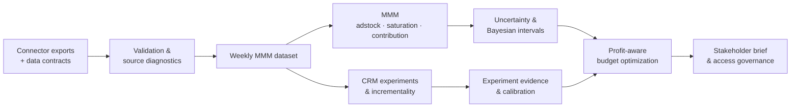

# Marketing Effectiveness Lab

> [!IMPORTANT]
> **📦 Archived — this work continues in [responsible-neobank-growth](https://github.com/rosscyking1115/responsible-neobank-growth).**
>
> This lab's marketing-measurement methodology has been folded into the
> [Responsible Neobank Growth](https://github.com/rosscyking1115/responsible-neobank-growth)
> platform, where the same causal-inference stack (CUPED, diff-in-diff, geo-lift,
> synthetic control) now lives alongside experimentation governance and release gating:
>
> - **MMM ↔ experiment reconciliation** ("closing the causal loop", 4.78×→0.45× error) → [`docs/case-studies/mmm-experiment-reconciliation.md`](https://github.com/rosscyking1115/responsible-neobank-growth/blob/main/docs/case-studies/mmm-experiment-reconciliation.md)
> - **Parameter-recovery & calibration validation** → [`docs/methodology/parameter-recovery-validation.md`](https://github.com/rosscyking1115/responsible-neobank-growth/blob/main/docs/methodology/parameter-recovery-validation.md)
> - **Benchmark note vs Meridian / Robyn / PyMC-Marketing** → [`docs/methodology/mmm-benchmark-note.md`](https://github.com/rosscyking1115/responsible-neobank-growth/blob/main/docs/methodology/mmm-benchmark-note.md)
>
> The code here remains complete and runnable as of the final release; the live
> dashboard and docs stay available as a historical reference. No further development
> happens in this repository.

[](https://github.com/rosscyking1115/marketing-effectiveness-lab/actions/workflows/ci.yml)


A **reference implementation** for marketing measurement: marketing mix modeling (MMM),
incrementality evidence, CRM experimentation, connector data quality, and profit-aware
budget decisions — built as a reusable Python package with a Streamlit dashboard.

> [!NOTE]
> A **reference implementation** of end-to-end causal-measurement work — the methodology,
> validation, and engineering — not a commercial product. It runs on deterministic demo data
> and real *public* datasets, and every modeling assumption and boundary is documented rather
> than hidden. See [`docs/methodology.md`](docs/methodology.md) for the measurement approach
> and how it is validated.

- **Project site:** <https://rosscyking1115.github.io/marketing-effectiveness-lab/>
- **Live dashboard:** <https://marketing-effectiveness-lab.streamlit.app/>

The point of the project is not a single model number — it is the **end-to-end workflow**:
data contract → source validation → diagnostics → modeling → incrementality evidence →
uncertainty → budget optimization → stakeholder communication → governance.



## What it does

**Data onboarding**
- Versioned data contracts and connector templates for ecommerce, web analytics, paid
  media, CRM, affiliate, influencer, display, and external-control exports.
- Connector assembly into an MMM-ready weekly dataset, with source-coverage and
  data-quality diagnostics.

**Measurement & modeling**
- Baseline econometrics with time-aware holdout validation.
- MMM-style adstock, saturation, contribution, ROI, and response curves.
- Uncertainty intervals and a lightweight Bayesian posterior layer.
- Lift-test evidence upload, quality governance, and experiment-informed calibration.

**Decisions**
- Profit-aware scenario planning and constrained budget optimization.
- Recommendation-readiness gates, executive summaries, and a one-page stakeholder
  business-impact brief (Markdown + PDF).

**Customer & CRM growth**
- Cohort, CLV, and lapse-risk analytics; target/holdout CRM incrementality with
  confidence intervals.
- Retention action planning and an end-to-end CRM experiment workflow: design, audience
  assignment, launch calendar, post-launch readouts, and a reusable learning library.

**Governance & reproducibility**
- Machine-readable model-run manifests, a local artifact registry, and a manifest
  comparison workflow.
- Access governance: role-based permissions, an approval workflow with
  separation of duties, and a tamper-evident (hash-chained) audit log.

## Example outputs

Real figures produced by the package on the demo data (regenerate with
`uv run --group viz python scripts/generate_readme_assets.py`).

| | |
| --- | --- |
|  |  |
| **Response curves** — diminishing returns by channel, used to decide where the next pound of spend pays back. | **Contribution & ROI** — where revenue actually comes from, and which channels earn their spend. |
|  |  |
| **Holdout uncertainty** — actual vs predicted revenue with a 90% band, so a recommendation carries its own confidence. | **CRM incrementality** — conversion lift with 95% intervals; green campaigns show evidence of real lift, grey/red do not. |

## Does the model actually work?

Because the demo data is *generated from known* adstock, saturation, and effect parameters, the
model can be held to the two questions a reviewer really asks — does it recover the truth, and is
its uncertainty honest? Full write-up in [`docs/validation.md`](docs/validation.md).

| | |
| --- | --- |
|  |  |
| **Calibration** — empirical holdout coverage vs nominal; the 90% posterior interval covers ~81% of held-out weeks, measured against the diagonal, not asserted. | **Recovery** — all 6 true channel ROIs land inside their 90% intervals, but the point estimates are inflated ~2–3× by media/seasonality confounding: honest uncertainty, biased central estimate, and precisely why experiment calibration exists. |

Building this surfaced (and fixed) a real numerical bug — an ill-conditioned Bayesian posterior
that had collapsed interval coverage to zero. See the write-up for the diagnosis and fix.

**The pay-off — closing the causal loop.** The bias above is an identification problem, not a
tuning problem; only an experiment can fix it. Simulating honest geo-lift tests against the known
ground truth and running them through the calibration layer pulls the inflated ROI back toward
truth — mean error **4.78× → 0.45× (91% closer)**. Full write-up in
[`docs/reconciliation.md`](docs/reconciliation.md).


## Tech stack

| Area | Tools |
| --- | --- |
| Language | Python ≥ 3.11 |
| Data & modeling | pandas, NumPy, statsmodels |
| App & charts | Streamlit, Plotly |
| Tooling | uv (env & lockfile), pytest, ruff |
| Optional groups | `data` (openpyxl, real public data), `brief` (reportlab, PDF brief), `viz` (matplotlib, README figures) |

## Quick start

Prerequisite: [uv](https://docs.astral.sh/uv/).

```powershell
# Generate the deterministic demo dataset (written to data/demo/)
uv run python scripts/generate_demo_data.py

# Launch the analyst dashboard
uv run streamlit run app/streamlit_app.py --server.port 8501 --server.headless true

# Tests and lint
uv run --group dev pytest
uv run --group dev ruff check .
```

The repository also includes a root `streamlit_app.py` entrypoint used by Streamlit Cloud.

## Working with real public data

The pipeline runs on the real **UCI Online Retail II** dataset (a UK online retailer), not
only synthetic data.

```powershell
# Customer / cohort / CLV analytics on real transactions
uv run --group data python scripts/load_public_data.py

# Assemble a weekly MMM outcome dataset through the connector pipeline
uv run --group data python scripts/build_public_mmm_dataset.py
```

> [!TIP]
> Each script writes a provenance-documented summary to `data/public/` (git-ignored) that
> states exactly which fields are real versus imputed. See
> [`docs/phase-41-real-public-data.md`](docs/phase-41-real-public-data.md) and
> [`docs/phase-44-real-connector-mmm.md`](docs/phase-44-real-connector-mmm.md).

## Stakeholder brief and governance demo

```powershell
# One-page business-impact brief (Markdown, plus PDF with the optional brief group)
uv run --group brief python scripts/build_stakeholder_brief.py

# Access-governance walkthrough (RBAC + approval workflow + tamper-evident audit log)
uv run python scripts/governance_demo.py
```

Generated artifacts are written under `.local/` (git-ignored) for local review.

## Project structure

```text
marketing-effectiveness-lab/
├─ app/streamlit_app.py        # Analyst dashboard
├─ streamlit_app.py            # Streamlit Cloud entrypoint
├─ src/marketing_effectiveness_lab/
│  ├─ analytics.py  mmm.py  modeling.py  bayesian.py  uncertainty.py
│  ├─ calibration.py  budget.py  reporting.py  governance.py  artifacts.py
│  ├─ customer.py  access.py
│  └─ data/                    # schema, connectors, assembly, diagnostics, generators,
│                              # online_retail adapter, shared feature definitions
├─ scripts/                    # demo data, real-data, stakeholder brief, governance demo
├─ tests/                      # pytest suite (19 files)
├─ docs/                       # product site (HTML) + phase notes (Markdown)
└─ data/demo/                  # generated demo data (git-ignored)
```

## Documentation

- [`docs/methodology.md`](docs/methodology.md) — **start here for the modeling**: adstock,
  saturation, priors, holdout and geo-lift calibration, and how each step is validated.
- [`docs/validation.md`](docs/validation.md) — **parameter recovery & uncertainty
  calibration**: because the demo data has known generating parameters, whether the model
  recovers the truth and whether its intervals are honest (`scripts/validate_recovery.py`).
- [`docs/reconciliation.md`](docs/reconciliation.md) — **MMM ↔ experiment reconciliation**: the
  causal loop — simulated geo-lift evidence calibrates the biased MMM toward truth
  (`scripts/reconcile_mmm_experiments.py`).
- [`docs/cross-validation.md`](docs/cross-validation.md) — **rolling-origin backtesting** across
  five quarters, plus an honest benchmark note vs Meridian / Robyn / PyMC-Marketing
  (`scripts/rolling_origin_cv.py`).
- [`docs/model-card.md`](docs/model-card.md) — **model card**: intended use, metrics,
  limitations, and when *not* to trust the model.
- The **project site** is a visual entry point: workflow, architecture, and data-contract
  pages under <https://rosscyking1115.github.io/marketing-effectiveness-lab/>.
- [`docs/data-dictionary.md`](docs/data-dictionary.md) — weekly schema, connector
  templates, and assembly mapping.
- [`docs/production-security-roadmap.md`](docs/production-security-roadmap.md) — security and
  data-handling notes, with RBAC/audit marked *demonstrated* and authentication/storage
  called out as *out of scope* for this reference.
- `docs/phase-*.md` — chronological design notes for each capability, from baseline
  econometrics through real public data, the stakeholder brief, and access governance.

## Deployment

- **Dashboard** — Streamlit Community Cloud, repository `rosscyking1115/marketing-effectiveness-lab`,
  branch `main`, main file `streamlit_app.py`.
- **Product site** — GitHub Pages serves the `/docs` folder.

---

See [`CONTRIBUTING.md`](CONTRIBUTING.md) for contribution lanes (measurement reliability,
data onboarding, CRM experimentation, engineering quality), [`SECURITY.md`](SECURITY.md)
for the public-data policy, and [`LICENSE`](LICENSE) (Apache-2.0). This is an open,
Apache-2.0 reference implementation for marketing measurement — free to read, run, and
build on.
