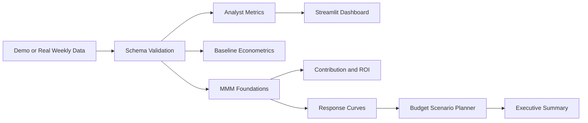
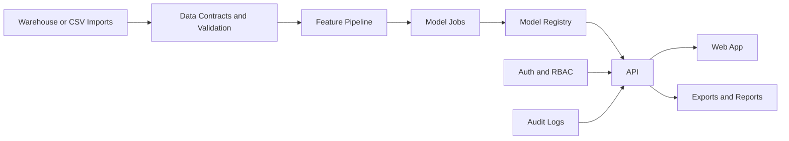

# Architecture

## Current Architecture

The current project is a local analytics product prototype.

## Code Structure

- `src/marketing_effectiveness_lab/data/` handles data generation and schema checks.
- `src/marketing_effectiveness_lab/analytics.py` handles dashboard metrics and diagnostics.
- `src/marketing_effectiveness_lab/modeling.py` handles baseline econometrics.
- `src/marketing_effectiveness_lab/mmm.py` handles MMM-style adstock, saturation, contribution, and response curves.
- `src/marketing_effectiveness_lab/budget.py` handles budget scenario planning.
- `src/marketing_effectiveness_lab/reporting.py` handles deterministic executive summary generation.
- `app/streamlit_app.py` renders the analyst dashboard.
- `tests/` covers reusable logic.

## Future Product Architecture

The project can evolve into a multi-user internal tool or SaaS product:

Suggested future stack:

- FastAPI for backend APIs
- Postgres for app metadata, users, scenarios, and audit logs
- Dagster for orchestration
- MLflow for model tracking
- dbt for governed marketing marts
- Next.js for a production web app

