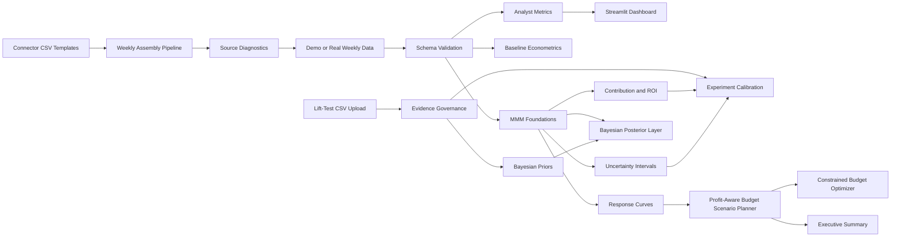
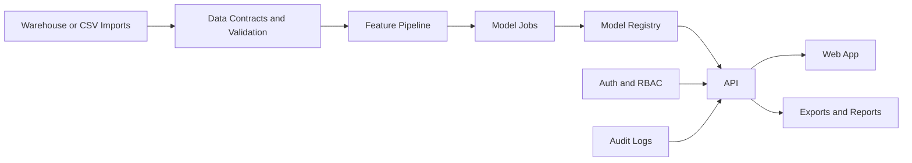

# Architecture

## Current Architecture

The current project is a local analytics product prototype.

## Code Structure

- `src/marketing_effectiveness_lab/data/` handles data generation and schema checks.
- `src/marketing_effectiveness_lab/data/connectors.py` handles connector templates and validation for common marketing exports.
- `src/marketing_effectiveness_lab/data/assembly.py` handles connector-to-weekly assembly for the MMM schema.
- `src/marketing_effectiveness_lab/data/diagnostics.py` handles source coverage and quality checks for assembled connector data.
- `src/marketing_effectiveness_lab/analytics.py` handles dashboard metrics and diagnostics.
- `src/marketing_effectiveness_lab/modeling.py` handles baseline econometrics.
- `src/marketing_effectiveness_lab/mmm.py` handles MMM-style adstock, saturation, contribution, and response curves.
- `src/marketing_effectiveness_lab/uncertainty.py` handles coefficient simulation for contribution and prediction intervals.
- `src/marketing_effectiveness_lab/bayesian.py` handles Bayesian posterior draws, experiment-informed priors, and posterior predictive intervals.
- `src/marketing_effectiveness_lab/calibration.py` handles lift-test templates, upload validation, evidence governance, and experiment calibration.
- `src/marketing_effectiveness_lab/budget.py` handles budget scenario planning, constrained allocation optimization, and profit-aware scenario diagnostics.
- `src/marketing_effectiveness_lab/reporting.py` handles deterministic executive summary generation.
- `app/streamlit_app.py` renders the analyst dashboard.
- `tests/` covers reusable logic.

## Future Product Architecture

The project can evolve into a multi-user internal tool or SaaS product:

Suggested future stack:

- FastAPI for backend APIs
- Postgres for app metadata, users, scenarios, and audit logs
- Dagster for orchestration
- MLflow for model tracking
- dbt for governed marketing marts
- Next.js for a production web app
