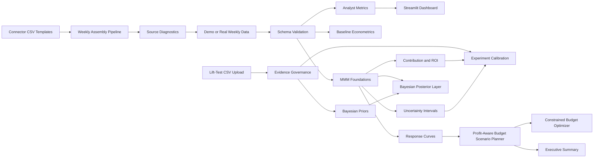

# Architecture

## Current Architecture

The project is a reusable Python analytics package with a Streamlit dashboard — a reference
implementation for marketing measurement, run locally on demo and public data.

```mermaid
flowchart LR
    R["Connector CSV Templates"] --> S["Weekly Assembly Pipeline"]
    S --> T["Source Diagnostics"]
    T --> A["Demo or Real Weekly Data"]
    A --> B["Schema Validation"]
    B --> C["Analyst Metrics"]
    C --> D["Streamlit Dashboard"]
    B --> E["Baseline Econometrics"]
    B --> F["MMM Foundations"]
    F --> G["Contribution and ROI"]
    F --> H["Uncertainty Intervals"]
    M["Lift-Test CSV Upload"] --> N["Evidence Governance"]
    N --> I["Experiment Calibration"]
    N --> O["Bayesian Priors"]
    G --> I
    H --> I
    F --> P["Bayesian Posterior Layer"]
    O --> P
    F --> J["Response Curves"]
    J --> K["Profit-Aware Budget Scenario Planner"]
    K --> Q["Constrained Budget Optimizer"]
    K --> L["Executive Summary"]
```

## Code Structure

- `src/marketing_effectiveness_lab/data/` handles data generation and schema checks.
- `src/marketing_effectiveness_lab/data/connectors.py` handles connector templates and validation for commerce, analytics, paid media, CRM, affiliate, influencer, display, and external-control exports.
- `src/marketing_effectiveness_lab/data/assembly.py` handles connector-to-weekly assembly for the MMM schema.
- `src/marketing_effectiveness_lab/data/diagnostics.py` handles source coverage and quality checks for assembled connector data.
- `src/marketing_effectiveness_lab/analytics.py` handles dashboard metrics and diagnostics.
- `src/marketing_effectiveness_lab/modeling.py` handles baseline econometrics.
- `src/marketing_effectiveness_lab/mmm.py` handles MMM-style adstock, saturation, contribution, and response curves.
- `src/marketing_effectiveness_lab/uncertainty.py` handles coefficient simulation for contribution and prediction intervals.
- `src/marketing_effectiveness_lab/bayesian.py` handles Bayesian posterior draws, experiment-informed priors, and posterior predictive intervals.
- `src/marketing_effectiveness_lab/calibration.py` handles lift-test templates, upload validation, evidence governance, and experiment calibration.
- `src/marketing_effectiveness_lab/budget.py` handles budget scenario planning, constrained allocation optimization, and profit-aware scenario diagnostics.
- `src/marketing_effectiveness_lab/governance.py` handles recommendation readiness gates for model fit, profit impact, spend movement, history, and evidence.
- `src/marketing_effectiveness_lab/reporting.py` handles deterministic executive summary generation, downloadable model-run reports, and machine-readable run manifests.
- `app/streamlit_app.py` renders the analyst dashboard.
- `tests/` covers reusable logic.

## Design Notes

The module boundaries are the point of the architecture: each stage of the measurement
workflow — contracts, assembly, diagnostics, modeling, uncertainty, calibration, budgeting,
governance, reporting — is a separate, independently testable module with a narrow interface.
That separation is what makes the methodology legible and the engine reusable.

For the modeling methodology behind `mmm.py`, `uncertainty.py`, `bayesian.py`,
`calibration.py`, and `budget.py`, see [`methodology.md`](methodology.md).
