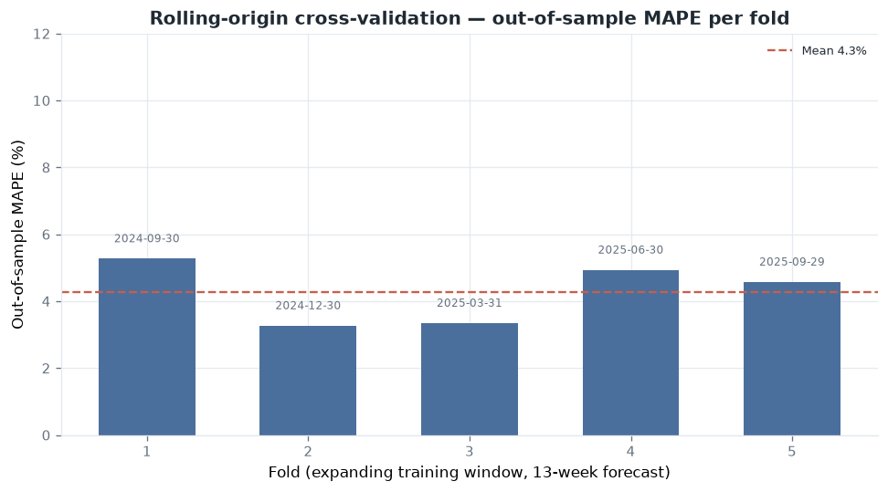

# Rolling-origin cross-validation

A single train/test split gives you one out-of-sample number, and one number can be luck. A
holdout that lands on an easy stretch of history flatters the model. Rolling-origin backtesting
refits on a growing history and forecasts the next block repeatedly, so generalisation gets
measured across several distinct periods instead.

Reproduce with:

```powershell
uv run --group viz python scripts/rolling_origin_cv.py
```

## Setup

Each fold fits on `df[:origin + horizon]` with `holdout_weeks = horizon`, so the model is only
ever scored on weeks it has not seen, and the training window grows fold to fold. The horizon is
13 weeks, one quarter ahead. The first fold trains on about 1.75 years.



| Fold | Train weeks | Forecast window | Out-of-sample MAPE |
| --- | --- | --- | --- |
| 1 | 91 | 2024-09-30 → 2024-12-23 | 5.3% |
| 2 | 104 | 2024-12-30 → 2025-03-24 | 3.3% |
| 3 | 117 | 2025-03-31 → 2025-06-23 | 3.3% |
| 4 | 130 | 2025-06-30 → 2025-09-22 | 4.9% |
| 5 | 143 | 2025-09-29 → 2025-12-22 | 4.6% |

Mean out-of-sample MAPE across the 5 folds is 4.3%, standard deviation 0.9%, range 3.3% to 5.3%.

The error is stable across quarters, including fold 1, which forecasts the Black Friday and Q4
peak and is the hardest window to predict. So the single 26-week holdout at about 5% MAPE was not
a lucky draw.

## How this compares with the established tools

This engine is a transparent reference implementation, kept deliberately legible. It is not
competing with the mature open-source MMM tools, and it is worth being specific about what they
add:

| Tool | What it adds over this reference |
| --- | --- |
| [Google Meridian](https://github.com/google/meridian) | Hierarchical Bayesian MMM, full posterior over adstock and saturation, geo-level modelling, reach and frequency, ROI priors from experiments. |
| [Meta Robyn](https://github.com/facebookexperimental/Robyn) | Ridge regression with evolutionary (Nevergrad) hyperparameter search over adstock and saturation, Pareto-front model selection, automated calibration to experiments. |
| [PyMC-Marketing](https://github.com/pymc-labs/pymc-marketing) | Full PyMC Bayesian MMM with MCMC (NUTS) over all transform parameters, custom priors, posterior predictive checks, time-varying effects. |

What this repository offers instead is legibility. Every transformation, prior, and validation
step is documented next to the code that implements it ([`methodology.md`](methodology.md)), the
estimator is checked against known ground truth ([`validation.md`](validation.md)), and the loop
between MMM and experiments is worked through end to end ([`reconciliation.md`](reconciliation.md)).
Reach for the tools above in production; read this one to understand how the pieces work.

The clearest methodological gap against those tools is sampling the adstock and saturation
parameters rather than fixing them, and modelling at geo level. Both sit at the top of the
[roadmap](product-roadmap.md).
