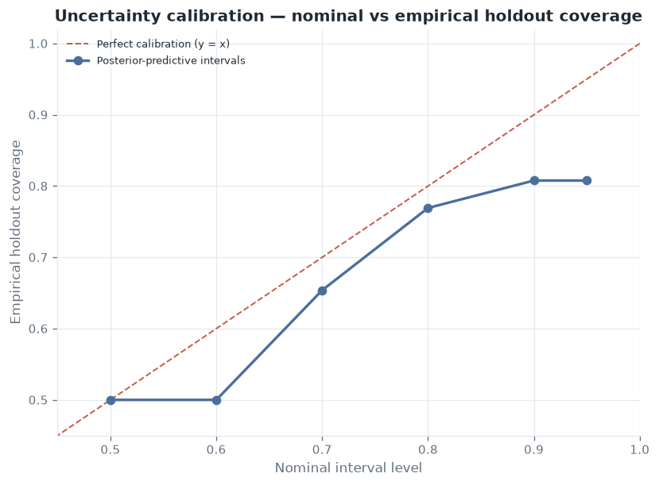
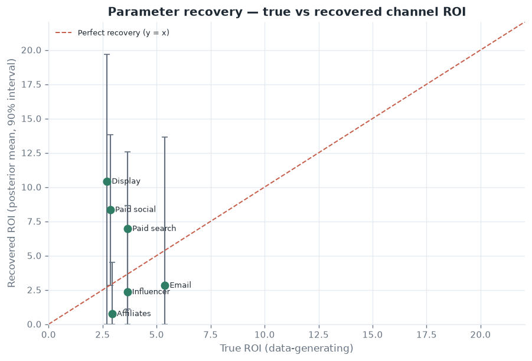

# Validation: parameter recovery & uncertainty calibration

Most portfolio MMM projects show a point estimate and stop. This project's demo dataset is
**generated from known** adstock, saturation, and effect parameters (see
[`data/generator.py`](../src/marketing_effectiveness_lab/data/generator.py)), so it can answer
the two questions a data-science reviewer actually asks:

1. **Does the estimator recover the truth?** (parameter recovery)
2. **Is the uncertainty honest?** (interval calibration)

The generator uses the *same* geometric adstock and Hill saturation (slope 1.35) as the model,
and its per-channel `decay` / `half_saturation` match the model defaults, so the fitted
coefficient on `{channel}_mmm` is directly comparable to the true generating `effect`.

Everything below is reproduced by one script:

```powershell
uv run --group viz python scripts/validate_recovery.py
```

---

## A bug this study caught

Building the calibration check immediately exposed a real defect in the Bayesian layer, worth
recording because *finding it is the point of a recovery harness*.

The design matrix mixes columns on wildly different scales — saturated media features live in
`[0, 1)` while `trend_squared` reaches the tens of thousands. Forming the Normal–Inverse-Gamma
posterior on that raw matrix meant inverting a near-singular `X'X` (**condition number ≈ 5×10¹²**).
The large-scale `trend_squared` coefficient drifted **~100× off** its OLS value (2558 vs 26),
holdout predictions came out an order of magnitude too high, and **interval coverage collapsed
to 0%**.

The fix (in [`bayesian.py`](../src/marketing_effectiveness_lab/bayesian.py)) whitens each column
by its L2 norm, solves the posterior in the well-conditioned basis (**cond ≈ 2×10²**), and maps
the draws back — an exact reparameterization that leaves the prior semantics unchanged. After the
fix, the posterior tracks OLS in the well-identified directions (`trend_squared` → 25.9 vs 26.2)
and holdout MAPE drops from ~1200% to ~5%. A regression test
(`test_bayesian_posterior_is_well_conditioned`) guards it.

## 1. Uncertainty calibration

For each nominal level, we measure the fraction of held-out weeks that actually fall inside the
posterior-predictive interval. Perfect calibration sits on the diagonal.



| Nominal | 50% | 60% | 70% | 80% | 90% | 95% |
| --- | --- | --- | --- | --- | --- | --- |
| Empirical holdout coverage | 50% | 50% | 65% | 77% | **81%** | 81% |

The intervals are **close to, and slightly narrower than, nominal** — the 90% band covers ~81%
of the 26 held-out weeks. That is an honest result: the uncertainty is roughly right, with a mild
tendency to over-confidence at the tails (expected for a conjugate posterior over a *fixed*
adstock/saturation design that ignores parameter uncertainty in the transforms themselves). It is
reported as-is rather than tuned to land on 90%.

## 2. Parameter recovery

Each channel's **true** ROI (from the generating process) is plotted against the **recovered**
posterior mean, with 90% credible intervals. Perfect recovery sits on the diagonal.



**The headline finding — calibrated, but biased.** All **6/6** true channel ROIs fall inside their
90% credible intervals, so the model *knows what it doesn't know*: the intervals are wide and they
cover the truth. But the **point estimates are inflated ~2–3×** (paid search 7.0× vs a true 3.7×;
paid social 8.4× vs 2.9×; display 10.4× vs 2.7×), and collinear channels (affiliates, email) are
crushed toward zero.

This is not a coding error — it is the **identification problem** at the heart of observational
MMM. In the generating process, media spend is deliberately correlated with seasonal demand
(spend scales with the same seasonality and promotion schedule that drives baseline revenue). The
model's controls — a linear/quadratic trend and a single binary season dummy — cannot fully absorb
that continuous seasonality, so the media coefficients soak up demand that seasonality actually
caused. A decision-maker who trusted the point estimates would over-invest.

**This is exactly why the engine has an incrementality-calibration layer.** An experiment (geo
holdout, conversion lift) provides an unconfounded causal anchor; the
[calibration](../src/marketing_effectiveness_lab/calibration.py) step reconciles the biased
observational estimate toward it. The [reconciliation study](reconciliation.md) closes this loop
end to end — calibration cuts the ROI bias measured here by ~91%. Recovery quantifies the size of
the bias the experiments are there to remove.

## What this validates

- A recovery harness against known ground truth — the single most convincing evidence an estimator
  works, and something real-data MMM cannot provide.
- Calibrated uncertainty, measured against the diagonal rather than asserted.
- A correct diagnosis of confounding vs. noise: wide-but-covering intervals plus biased point
  estimates, and the reason (identification), stated plainly.
- A real numerical bug found, fixed, and regression-tested along the way.

## Honest limitations

- Single dataset / single seed. Rolling-origin cross-validation across many holdout windows and
  seeds is the natural next step (see [roadmap](product-roadmap.md)).
- The Bayesian layer is a posterior over the *fixed* transformed design; it does not sample the
  adstock/saturation parameters, so it understates transform uncertainty — visible as the mild
  tail under-coverage above.
- Recovery is assessed on ROI and the media coefficient; the control block is not scored.
